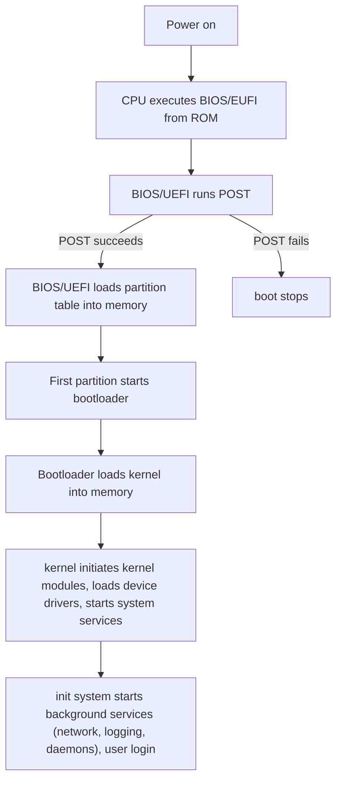

## Boot Process

1. BIOS/UEFI
	* BIOS
	  * older
	  * Master Boot Record (MBR) for disk partitioning
		* uses 32 bits for block addressing, limiting disk sizes to ~2TB ($2^{32} \times 512\text{-byte sized sectors}$)
	* UEFI
	  * GUID Partition Table (GPT) for disk partitioning
		* uses 64 bits for block addressing
	  * faster, more security features (secure boot)
2. Power-on self-test (POST)
	* set initial device state from firmware
	* detect any hardware component errors
	* any failure ends the boot process
3. Bootloader (GRUB2)
	* locate operating system kernel, load kernel into memory
4. kernel
	* kernel
	* initiate background processes, device drivers, kernel modules
	* start init system
5. init system (systemd)
	* mount file systems
	* start background services, daemons, drivers
	  * networking, sound, power management
	  * targets for dependency ordering
	* user login

