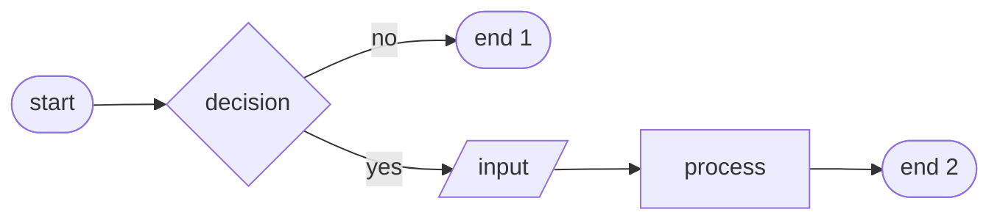
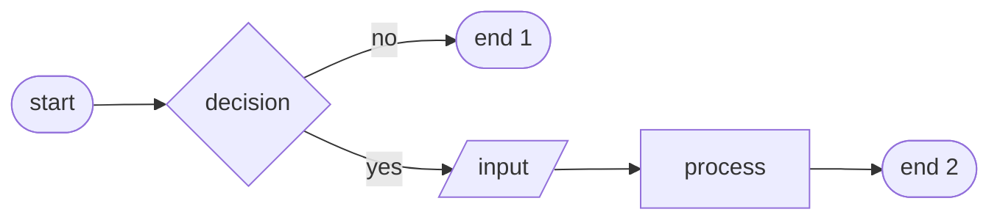
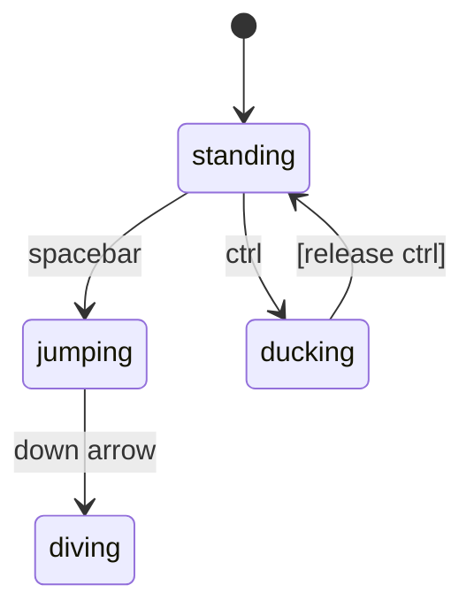

## Flowchart

* https://mermaid.ai/open-source/syntax/flowchart.html

````

```mermaid
flowchart LR
  1([start]) --> 2{decision}
  2a([end 1])
  2b[/input/] --> 3[process] --> 4([end 2])
  2 -->|no| 2a
  2 -->|yes| 2b
```
````



```mermaid
flowchart LR
  1([start]) --> 2{decision}
  2a([end 1])
  2b[/input/] --> 3[process] --> 4([end 2])
  2 -->|no| 2a
  2 -->|yes| 2b
```


## State diagram

* https://mermaid.ai/open-source/syntax/stateDiagram.html

````

```mermaid
stateDiagram-v2
	[*] --> standing
	standing --> jumping : spacebar
	jumping --> diving : down arrow
	standing --> ducking : ctrl
	ducking --> standing : [release ctrl]
```
````


```mermaid
stateDiagram-v2
	[*] --> standing
	standing --> jumping : spacebar
	jumping --> diving : down arrow
	standing --> ducking : ctrl
	ducking --> standing : [release ctrl]
```
