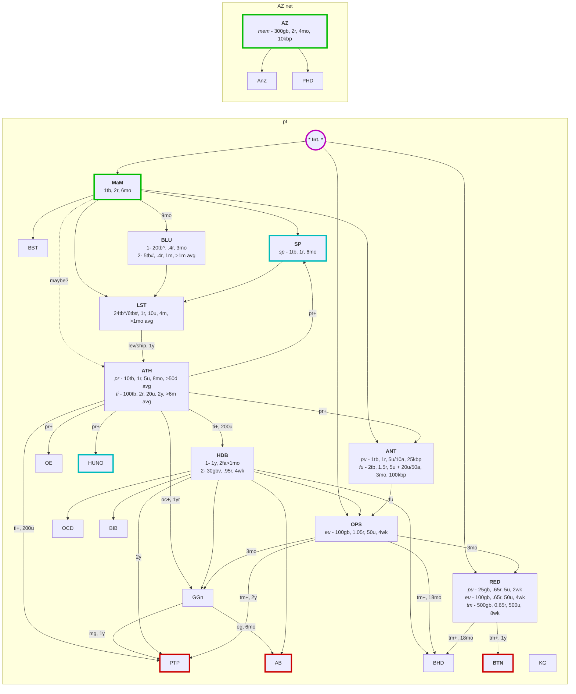

## Apps

* [radarr](https://github.com/Radarr/Radarr) - movie organization/manager
* [sonarr](https://github.com/Sonarr/Sonarr) - show/series organization/manager
* [bazarr](https://github.com/morpheus65535/bazarr) - subtitle manager for radarr and sonarr
* [prowlarr](https://github.com/Prowlarr/Prowlarr) - indexer manager
* [flaresolverr](https://github.com/FlareSolverr/FlareSolverr) - proxy server to bypass cloudflare
* [jellyfin](https://github.com/jellyfin/jellyfin) - media system backend and web api
* [seerr](https://github.com/seerr-team/seerr) - media request and discovery manager
* [autobrr](https://github.com/autobrr/autobrr) - download automation
* [profilarr](https://github.com/Dictionarry-Hub/Profilarr/) - manage quality configs for radarr & sonarr

## PT

